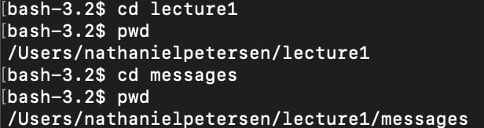

# Command "cd" - changes the current working directory
## No arguments example:

In the code example above, the current working directory is first set to `/Users/nathanielpetersen/lecture1`

The `cd` command with no arguments is then run.

There is no output indicating an error nor any output in general. 

However, checking our current working directory with the `pwd` command shows that our current working directory has been changed to our home directory. This shows that using the `cd` command with no arguments results in our current working directory being changed to our home directory.

## Path to a directory as argument example:

In the code example above, the current working directory is first set to `/Users/nathanielpetersen/lecture1`

The `cd` command with the directory `messages` supplied as an argument is then run. 

Once again, no output is provided, including any output indicating an error. 

We can see that the `cd` command worked by running the `pwd` command, which shows us that the current working directory has been switched from `/Users/nathanielpetersen/lecture1` to `/Users/nathanielpetersen/lecture1/messages`. This shows that using the `cd` command with a directory supplied as its argument results in the current working directory being switched to the newly supplied directory.

## Path to a file as argument example:

In the code example above, the current working directory is first set to `/Users/nathanielpetersen/lecture1`

The `cd` command with the file `Hello.java` supplied as an argument is then run. 

This time, an error message appears in the terminal, stating `Hello.java: Not a Directory`. As the error message suggests, this error occured because `cd` cannot change the current working directory to anything other than a directory, including java files.

# Command "ls" - lists out files in a directory
## No arguments example:

In the code example above, the current working directory is first set to `/Users/nathanielpetersen/lecture1`

The `ls` command with no arguments is then run. The terminal then outputs `Hello.class Hello.java README messages`, which is a list of all the files contained in `lecture1`. In this case, the `ls` command with no arguments simply lists out all the files stored in the current working directory, ie, `/Users/nathanielpetersen/lecture1`

There is no additional output to indicate that this behavior is an error.

## Path to a directory as argument example:

In the code example above, the current working directory is first set to `/Users/nathanielpetersen/lecture1`

The `ls` command with the path to a directory `/Users/nathanielpetersen/lecture1/messages` supplied as an argument is then run. The terminal then outputs `en-us.txt es-mx.txt zh-cn.txt`, which is a list of all the files contained in the directory `messages`. Similar to when no arguments are supplies, the `ls` command supplied with a directory will list out the files contained in that directory.

There is no additional output to indicate that this behavior is an error.

## Path to a file as argument example:

In the code example above, the current working directory is first set to `/Users/nathanielpetersen/lecture1`

With the path to a file as an argument, "ls" seems to repeat the argument provided, ie the path to the file or the file's name

# Command "cat"
## No arguments example:

In the code example above, the current working directory is first set to `/Users/nathanielpetersen/lecture1`

With no arguments the "cat" command places the terminal into a mode where every key on the keyboard is logged to some collection of characters, such as the up arrow key being mapped to "^[[A".

## Path to a directory as argument example:

In the code example above, the current working directory is first set to `/Users/nathanielpetersen/lecture1`

With a path to a directory as the argument, "cat" returns a message stating that the argument given is a directory. 

## Path to a file as argument example:

In the code example above, the current working directory is first set to `/Users/nathanielpetersen/lecture1`

With a path to a file as the argument, "cat" reads out the text contents of that file.
